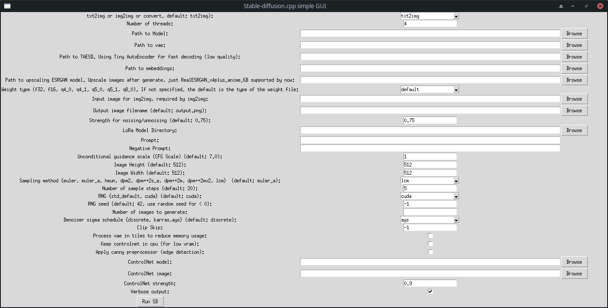

# Stable-diffusion-cpp-GUI
**Work in progress!**

Simple GUI for Stable-diffusion.cpp created with the Tkinter library. Just place alongside executable from the project [stable-diffusion.cpp](https://github.com/leejet/stable-diffusion.cpp).

## Screenshot

## Features:
- Direct editing of all options supported by Stable-diffusion.cpp (not all options implemented yet).
- Saving of last used options in `config.txt`.
- Generated image is shown in GUI window (works but it is a little wonky).
- Linux x64 binary included in the Releases section.

## How to run
Place stable-diffusion.cpp executable and `stable-diffusionCpp-GUI.py` in the same folder and run `python stable-diffusionCpp-GUI.py`

## How to compile
- Clone this repo with `git clone https://github.com/Topping1/Stable-diffusion-cpp-GUI` and go to the downloaded folder with `cd Stable-diffusion-cpp-GUI`.
- Install [PyInstaller](https://pypi.org/project/pyinstaller/) package with `pip install pyinstaller`.
- Execute `pyinstaller stable-diffusionCpp-GUI.py`,
- Executable will be located in the `/dist/stable-diffusionCpp-GUI/` folder.

## TODO:
- [] Tabbed interface to group similar options
- [x] Implement a file dialog for choosing model files
- [] Finish implementing tooltips for all options
- [] Shorten lenght of option labels
- [] Add Photomaker options

It should work on any platform that Stable-diffusion.cpp supports (not tested fully yet)
